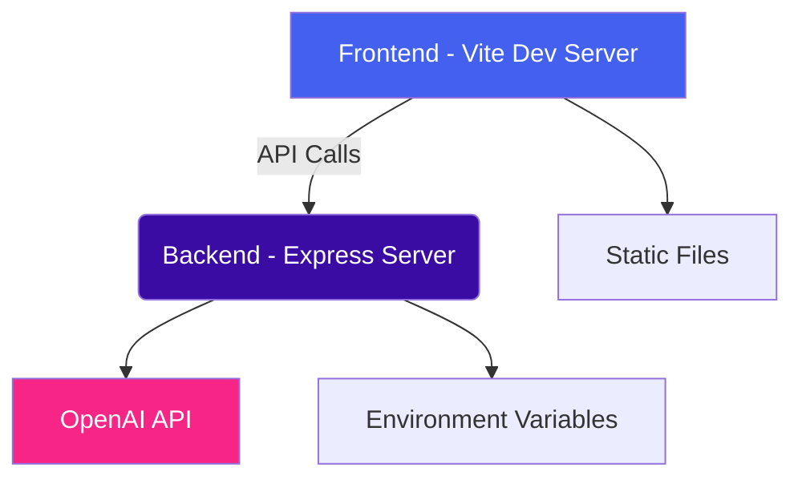

# LLM Customer Support Flow Debugger Architecture

## Component Details

### Frontend (Port 8080)
- Built with HTML, CSS, JavaScript
- Uses Vite for development and build
- Communicates with backend via API calls
- Serves static files during development

### Backend (Port 3000)
- Built with Node.js and Express
- Handles API requests from frontend
- Integrates with OpenAI API (when configured)
- Reads environment variables for configuration

### Data Flow
1. User interacts with frontend UI
2. Frontend makes API calls to backend for LLM processing
3. Backend processes request and calls OpenAI API if configured
4. Backend returns results to frontend
5. Frontend displays results to user

## Development Setup

1. Frontend runs on http://localhost:8080/
2. Backend runs on http://localhost:3000/
3. API calls from frontend are proxied to backend during development